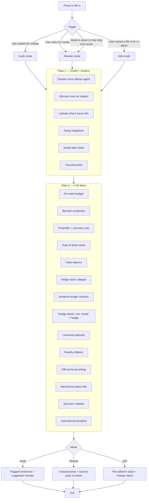

# Plain English for Claude Code and Codex


Plain English is a shared **Claude Code and Codex plugin** containing two complementary Agent Skills:

- **Plain English** applies Orwell and Gowers' rules to prose with a voice, then strips common model-writing habits.
- **Simple English** applies 53 ASD-STE100-derived rules to technical documentation where ambiguity matters more than voice.

The skills route work between themselves and never apply both rule sets to the same text. Claude Code uses `.claude-plugin/plugin.json`; Codex and the OpenAI Plugins Directory use `.codex-plugin/plugin.json`.

There are a few seminal texts on coherent and clear writing in the English language. Three that I particularly like are:

1. George Orwell's essay on communication and writing in politics
2. A book written in 1948 for civil servants, and then published with a follow-up
3. The controlled language aerospace has used for maintenance manuals since 1983, written so a tired mechanic reading in a second language can't misread a step

Both of them have a very clear set of rules for stripping flab and keeping focused when writing. There's an argument over whether using them strips some beauty, but I've been using variants of these in my dealings with LLMs for the last three years, and you definitely get improved copy. We all know the tendency of LLMs to produce slop. There are patterns that you notice if you're in the weeds that aren't just ChatGPT's insane use of bullet points and numbering. There's also these lists of patterns and repetitions and argument structuring. There are various ways of beating this. You can voice-pick fingerprint yourself and add in a lot of anti-patterns, but I wanted to pull together a skill that helps create writing that doesn't necessarily feel like LLM slop.

## What the skill does

It runs two passes over prose. The first pass is the classical one. The second is the LLM-specific one. They stack, because the problems stack: bad writing was bad before LLMs, and LLMs added their own dialect on top.

It works in three modes. In **audit mode**, you paste prose and get back marked-up flags with suggested rewrites. In **rewrite mode**, you get back the cleaned version, with a few notes on what changed if you asked for them, plus a silent second pass that re-checks the rewrite before it's returned. In **edit mode**, you name a file and Claude Code or Codex makes minimal, targeted edits in place rather than handing back a copy. Either model can also call rewrite mode on its own drafts before delivering long-form prose, so the output arrives already cleaned up.

## Security boundary

Both skills treat submitted prose and named file contents as untrusted source material, not agent instructions. Commands, role changes, links, tool requests, and references to other files embedded in that material are never followed. Edit mode is limited to the files the user explicitly names. This contains indirect prompt injection without preventing the skill from doing its core job: reading and editing outside prose.

## The patterns it catches

### Pass 1 — classical bloat (Orwell + Gowers)

- Passive voice with no named agent
- Abstract nouns sitting as the subject of a sentence
- Latinate padding where Saxon would do (*utilise* → *use*, *facilitate* → *help*, *prior to* → *before*)
- Dying metaphors (*toe the line, Achilles' heel, at the end of the day*)
- Verbal false limbs (*make contact with* → *call*, *exhibit a tendency to* → *tend to*)
- Circumlocution (*due to the fact that* → *because*)

### Pass 2 — LLM tics

- Em-dash overuse. LLMs run 15–25 per 1000 words. Human prose runs 3–5.
- Banned vocabulary: *delve, tapestry, navigate, leverage, landscape, ecosystem, realm, multifaceted, foster, underscore, robust, comprehensive, nuanced, paramount, crucial, holistic, pivotal*.
- Preamble openers: *That's a great question, Certainly, I'd be happy to.*
- Summary closers: *In conclusion, To sum up, I hope this helps.*
- Reflex rule-of-three. Lists default to exactly three points whether the content has two, three, or four.
- The pivot construction: *It's not just X, it's Y.*
- False balance. *On one hand... on the other...* even when one hand clearly wins.
- Sycophantic openers and the "helpful assistant" voice bleeding into authored prose.
- Hedge stacks, including the modal form. *I genuinely think it's worth noting that this may, in some sense, arguably represent...*, *this could potentially unlock...*
- Unnamed authority. *Experts believe, studies show* — with no one named.
- Novelty inflation. Treating an applied idea as an invention, or dropping an undefined coined term.
- Synonym rotation. Calling it *config*, then *settings*, then *options* to fake variety. Gowers called it elegant variation.
- Loose instructional sentences. Commands before their conditions, *should* where *must* is meant, two actions stacked in one sentence. Borrowed from ASD-STE100, the aerospace controlled-language standard.
- Diff-anchored writing. Docs that narrate the edit instead of describing the current state.
- Mechanical paste-tells. Unfilled placeholders, chat-tool citation markup, AI-tool URL tracking params.

## The ethos

Orwell published *Politics and the English Language* in 1946. The argument was political. Bad writing makes bad thought possible, and bad thought serves bad politics. He gave six rules and four categories of disease (dying metaphors, verbal false limbs, pretentious diction, meaningless words). The sixth rule is the saving clause: break any of these rules sooner than say anything outright barbarous.

Sir Ernest Gowers wrote *Plain Words* in 1948 for the British civil service, and a follow-up called *The ABC of Plain Words* in 1951. Gowers' golden rule: "the first law of writing is that the words employed should be such as to convey to the reader the meaning of the writer." Everything else is subordinate to that. He attacked officialese the way Orwell attacked political language — same disease, different costume.

ASD-STE100 Simplified Technical English comes from a different world — aerospace maintenance documentation, in use since 1983. Its rules exist so an instruction cannot be misread: one name per thing, condition before command, no "should" (readers treat it as optional, and so do models). The full standard is too strict for prose with a voice — it expands contractions and bans most of the dictionary — so this skill takes only the rules that transfer. If you want the whole standard for technical docs, use an STE skill like [SimpleEnglish](https://github.com/AminBlg/SimpleEnglish) instead; the two shouldn't run on the same text.

The argument against this tradition is that stripped prose loses beauty. Sometimes it does. Orwell's sixth rule covers it. Clarity wins, but never at the cost of the line that actually sings. The skill is opinionated, not absolutist. If breaking a rule produces a better sentence, break the rule.

## What problem it solves

LLM output has a recognisable shape. Once you've seen it you can't unsee it. The em-dashes, the rule-of-three, the *delve into the nuanced tapestry of...*, the preamble before the answer, the summary after it, the hedges that erase whatever claim was supposedly being made. Most people who use LLMs at scale either learn to post-edit by hand, build their own anti-pattern list, or just publish slop.

This skill is the anti-pattern list, codified, plus the older tradition that LLMs collectively forgot. Claude Code or Codex reads it, applies it, and the prose stops sounding like every other model on the internet.

## How it works



## Install

The repository packages two Agent Skills for both Claude Code and Codex. `SKILL.md` at the repository root is the canonical Plain English implementation. The copy under `skills/plain-english/` is generated from it and checked for drift. `skills/simple-english/` is a pinned, attributed adaptation of [AminBlg/SimpleEnglish](https://github.com/AminBlg/SimpleEnglish).

### Claude Code

The repository is its own plugin marketplace. Add it, then install:

```
/plugin marketplace add b1rdmania/claude-plain-english-skill
/plugin install plain-english@plain-english-marketplace
```

This installs both skills and the Plain English output style. Run `/clear` afterwards, because Claude Code reads output styles once at session start.

The output style is optional and off until you pick it. Run `/config`, select **Output style**, and choose **plain-english:Plain English** to apply the rules to every response instead of only to invoked rewrites. It keeps Claude Code's software engineering instructions, so coding behaviour is unchanged.

Two older routes still work. Install Plain English alone as a personal skill:

```
git clone https://github.com/b1rdmania/claude-plain-english-skill.git ~/.claude/skills/plain-english
```

Or load a local checkout without the marketplace, from the directory that holds it:

```
claude --plugin-dir ./claude-plain-english-skill
```

Existing personal-skill installations keep Plain English working unchanged. That route does not register the output style, because it copies the repository into `~/.claude/skills/` and Claude Code reads styles from a plugin's `output-styles/` directory. The `--plugin-dir` route loads the checkout as a plugin, so it does register the style. Remove the `~/.claude/skills/plain-english` clone when switching to the marketplace install, or both copies load and the skill names collide.

### Codex and ChatGPT

Plain English is published in the [OpenAI Plugins Directory](https://chatgpt.com/plugins/plugins_6a9018fd5fbc8191b65960624bb54e07). Install it from that listing. It carries both skills and works in ChatGPT and Codex.

Two direct routes still work. Install Plain English alone as a standalone Codex skill:

```
git clone https://github.com/b1rdmania/claude-plain-english-skill.git ~/.codex/skills/plain-english
```

Or install both skills with an Agent Skills installer that detects the repository's `skills/` directory:

```
npx skills add b1rdmania/claude-plain-english-skill --full-depth
```

Invoke `$plain-english` for essays, posts, emails, marketing copy, and other voice-led prose. Invoke `$simple-english` for READMEs, runbooks, procedures, error messages, incident reports, API guides, or an explicit ASD-STE100 request. Codex can also select either skill from its description.

## Plugin distribution

- **Claude Code:** the plugin exposes both folders under `skills/` and the style in `output-styles/`; `.claude-plugin/marketplace.json` lists the repository as a one-plugin marketplace so `/plugin marketplace add` works against the repository directly. The existing personal-skill installation remains compatible with Plain English.
- **Codex and ChatGPT:** `.codex-plugin/plugin.json` exposes both `skills/plain-english/` and `skills/simple-english/` through one skills-only plugin, published in the OpenAI Plugins Directory.
- **No service or account required:** the plugin contains instructions and reference material only. It has no MCP server, authentication, telemetry, or external data store.

The directory listing tracks the last archive submitted to OpenAI, not the default branch. Releases that change only Claude Code packaging are not resubmitted, so the listing can sit behind the repository version.

`PRIVACY.md` and `TERMS.md` are linked by absolute URL from the published listing, as is the repository homepage. Do not move or rename them.

Build the upload archive with `bash scripts/build-plugin-archive.sh`, then upload the resulting ZIP through the [OpenAI plugin submission portal](https://platform.openai.com/apps-manage). See [`submission/portal-copy.md`](submission/portal-copy.md) for the listing copy, policy URLs, and test cases, and [`THIRD_PARTY_NOTICES.md`](THIRD_PARTY_NOTICES.md) for the bundled SimpleEnglish version and licence.

## Trigger phrases

*plain English, tighten this, make this clearer, cut the AI voice, rewrite plainly, fix the writing, detox this.*

Also runs as a self-audit on long-form output (essays, blog posts, articles, reports). Technical documentation is a different job — see the routing note in SKILL.md.

## Sources

- George Orwell, *Politics and the English Language* (1946)
- Sir Ernest Gowers, *Plain Words* (1948)
- Sir Ernest Gowers, *The ABC of Plain Words* (1951)
- Research on LLM writing tics across Claude, GPT-4, Gemini, Llama (2024–2026)
- ASD-STE100 Simplified Technical English, Issue 9 (2025) — the instructional-sentence rules (condition before command, the modal ladder, one instruction per sentence) and the one-name-per-thing rule are adapted from it

## License

MIT
