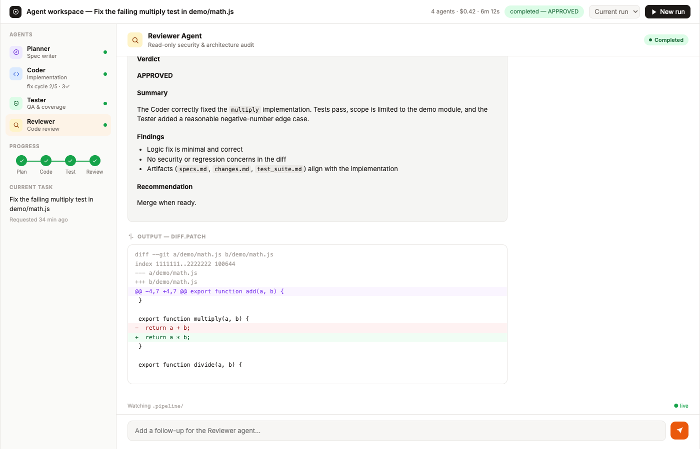
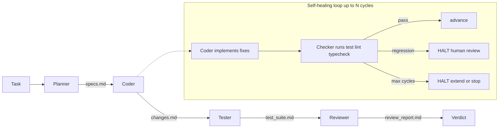
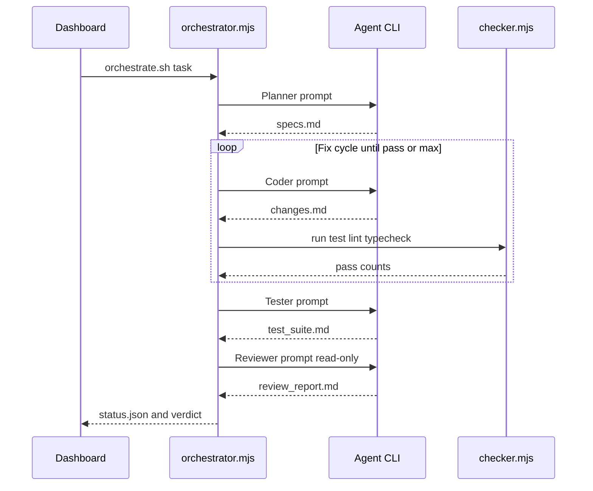
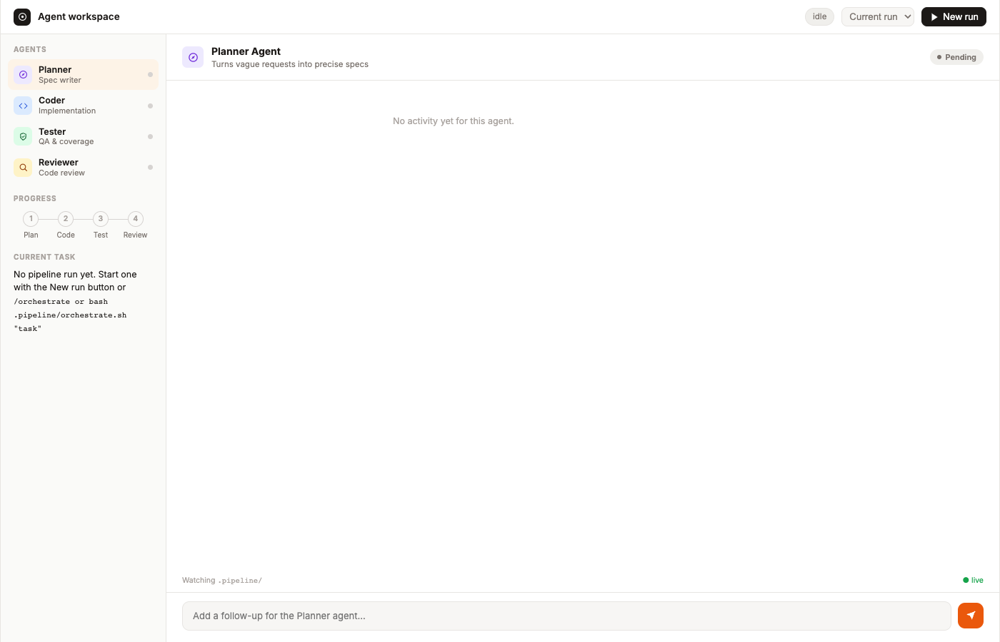
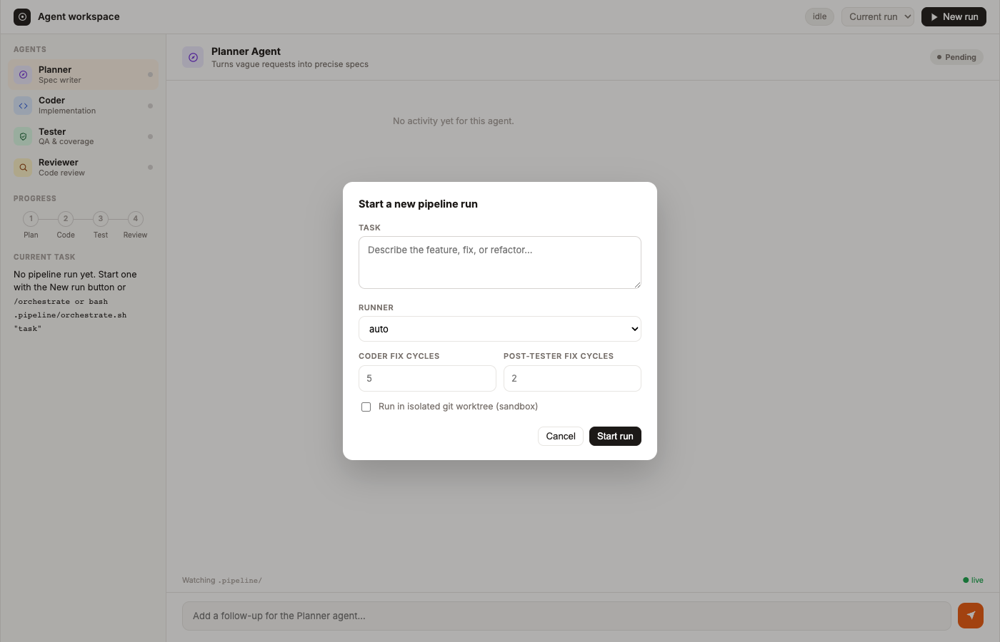
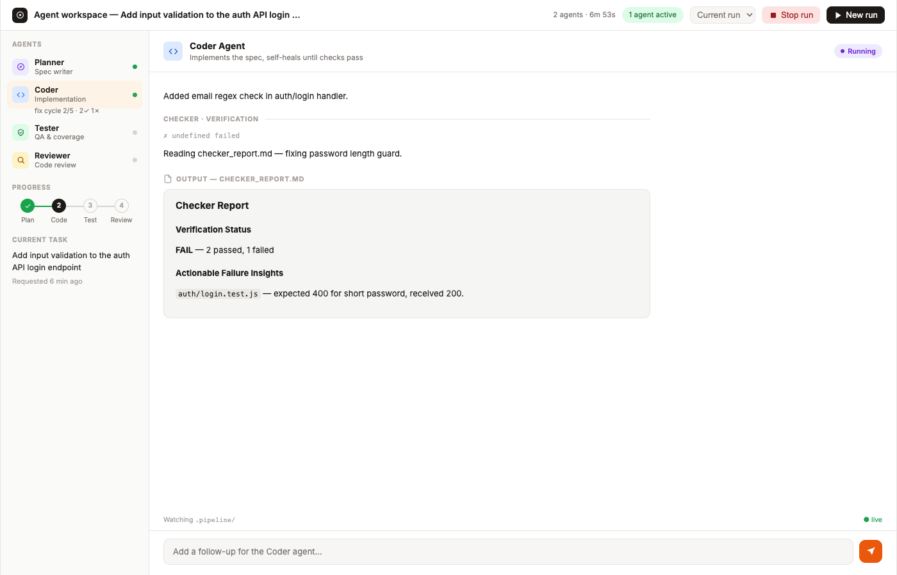
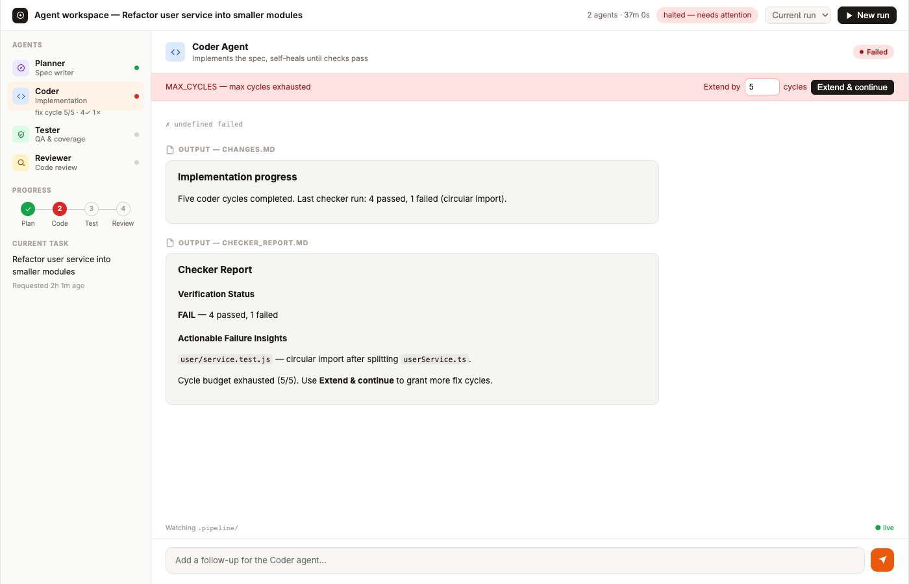

# /orchestrate

A drop-in agent skill that adds a self-healing multi-agent pipeline to **any existing repository** — **Planner → (optional Designer) → Coder (fix loop) → Tester → Reviewer → (optional Handoff)** — with a live local dashboard at http://localhost:4600.

Install the skill with `npx skills add`, bootstrap the pipeline scaffold into your project once, then invoke `/orchestrate` from Cursor (or run `bash .pipeline/orchestrate.sh` from any agent). The orchestrator itself uses only Node.js built-ins — no runtime `npm install` for the pipeline.

```bash
# In your existing project (after install + bootstrap — see Quickstart)
bash .pipeline/orchestrate.sh "Add rate limiting to the auth API"
# → http://localhost:4600
```



---

## Table of contents

- [Why this exists](#why-this-exists)
- [Architecture](#architecture)
- [Quickstart](#quickstart)
- [What gets added to your repo](#what-gets-added-to-your-repo)
- [Dashboard walkthrough](#dashboard-walkthrough)
- [Installing an agent CLI](#installing-an-agent-cli)
- [The pipeline stages](#the-pipeline-stages)
- [The self-healing loop, in depth](#the-self-healing-loop-in-depth)
- [Extending a halted run](#extending-a-halted-run)
- [The dashboard](#the-dashboard)
- [How live updates work](#how-live-updates-work)
- [CLI reference](#cli-reference)
- [Configuration reference](#configuration-reference)
- [Guardrails and safety](#guardrails-and-safety)
- [Run history and state files](#run-history-and-state-files)
- [Multiple repos on one machine](#multiple-repos-on-one-machine)
- [Editor / agent discovery](#editor--agent-discovery)
- [Where this excels](#where-this-excels)
- [Limitations and known trade-offs](#limitations-and-known-trade-offs)
- [Future improvements](#future-improvements)
- [Troubleshooting](#troubleshooting)
- [Developing this skill (contributors)](#developing-this-skill-contributors)

---

## Why this exists

Point-in-time "AI writes code" tools stop at generation. This pipeline is built around a different idea: **a coding agent should verify its own work against real test/lint/typecheck commands, keep fixing until it's actually green, and then hand off to independent test-writing and read-only review stages** — the same separation of duties a human engineering team uses (implement → test → review), automated end to end, with a human able to watch and intervene at any point rather than finding out after the fact.

Two production-grade patterns are fused into one pipeline instead of run as separate tools:

- **Builder–Checker self-healing loop** — the Coder doesn't just write code once; it iterates against deterministic (non-LLM) verification until checks pass, with hard guardrails against infinite loops and silent regressions.
- **Planner → (optional Designer) → Coder → Tester → Reviewer → (optional Handoff) waterfall** — each stage has a narrow job and hands a markdown artifact to the next, so a human (or another agent) can inspect exactly what happened at each step.

## Architecture





Everything the agents produce is a plain file under `.pipeline/`. The orchestrator is the only thing that reads/writes `status.json` and `events.jsonl`; the dashboard only ever reads them (plus two small control endpoints to start/stop/extend a run). This means you can run the whole pipeline with **no dashboard running at all** — `orchestrate.sh` and `orchestrator.mjs` work standalone from any terminal or CI job.

## Quickstart

Use this in a project you already have — not as a standalone app you clone and live in.

### Requirements

- **Node.js ≥ 18** — the pipeline orchestrator uses only `node:` built-ins (no runtime `npm install` for `.pipeline/` or `pipeline/`)
- **At least one agent CLI** on your `PATH` — see [Installing an agent CLI](#installing-an-agent-cli)
- **A git repository** — recommended; required for `--sandbox` worktree isolation

### 1. Install the skill (once per project or globally)

From the root of **your existing project**:

```bash
# Project scope (committed with your repo via .agents/skills/)
npx skills add isholaomotayo/orchestrator --skill orchestrate -a cursor -y --copy

# Or global scope (all projects on this machine)
npx skills add isholaomotayo/orchestrator --skill orchestrate -g -a cursor -y --copy
```

Use `--copy` on Cursor if symlinked skills are not discovered. Other agents: swap `-a cursor` for `claude-code`, `codex`, etc. Browse at [skills.sh](https://skills.sh).

### 2. Bootstrap the pipeline scaffold (once per project)

`npx skills add` installs **agent instructions only**. Copy the runtime files into your repo:

```bash
bash .agents/skills/orchestrate/scripts/bootstrap.sh
```

This adds `.pipeline/` and `pipeline/` to your project and merges `orchestrate` scripts into `package.json` if present. It also drops in `AGENTS.md` / `CLAUDE.md` when your repo does not already have them.

### 3. Run your first pipeline

**From your agent (recommended):**

```
/orchestrate Add rate limiting to the auth API
```

**From the terminal:**

```bash
bash .pipeline/orchestrate.sh "Add rate limiting to the auth API"
# optional: --runner claude --sandbox
```

The dashboard starts automatically on first run → **http://localhost:4600**

Or open the UI without starting a run:

```bash
node pipeline/ui-server.mjs
```

### 4. Read the verdict

When the run finishes, check `.pipeline/review_report.md` for the audit verdict (`APPROVED`, `REQUEST_CHANGES`, `BLOCK`). If it halts, inspect `.pipeline/checker_report.md`.

---

## What gets added to your repo

After install + bootstrap, your **existing** project gains:

| Path | Purpose |
|------|---------|
| `.agents/skills/orchestrate/` | Skill instructions + bootstrap script (from `npx skills add`) |
| `.pipeline/` | Config, prompts, entrypoint (`orchestrate.sh`), run artifacts (gitignored at runtime) |
| `pipeline/` | Orchestrator, checker, dashboard server (committed scaffold) |
| `AGENTS.md` / `CLAUDE.md` | Agent rules (bootstrapped if missing) |
| `.cursor/commands/orchestrate.md` | Cursor `/orchestrate` command (bootstrapped if missing) |

Your application code, dependencies, and structure stay as they are. The pipeline runs **your** `test` / `lint` / `typecheck` commands from `.pipeline/config.json` against **your** codebase.

To update the skill later: `npx skills update orchestrate`. To refresh the scaffold from upstream, re-run the bootstrap script (backs up nothing — only run on a fresh install or when you intend to overwrite `.pipeline/` and `pipeline/`).

## Dashboard walkthrough

The dashboard at **http://localhost:4600** is the control surface for every run. You can start from the CLI, from `/orchestrate` in your agent, or from the UI itself.

### Step 1 — Open the workspace

From your project root, start the UI (optional) or let `orchestrate.sh` boot it on first run:

```bash
node pipeline/ui-server.mjs
# or
bash .pipeline/orchestrate.sh "your task"
```

On a fresh install you see the idle workspace with agent sidebar, progress stepper, and **New run**:



### Step 2 — Start a run

**Option A — Agent slash command**

```
/orchestrate Add rate limiting to the auth API
```

**Option B — CLI**

```bash
bash .pipeline/orchestrate.sh "Add rate limiting to the auth API" --runner claude
```

**Option C — Dashboard modal** (task, runner, cycle limits, sandbox):



### Step 3 — Watch agents work

The sidebar shows each agent's status. During the Coder fix loop you see the active cycle, checker pass/fail counts, and a live activity feed:



### Step 4 — Review the verdict

When all stages finish, the header shows `completed — APPROVED` (or another verdict). Select **Reviewer** to read `review_report.md` and the colorized `diff.patch`:


### Step 5 — Extend if cycles are exhausted

If the Coder hits `MAX_CYCLES`, the dashboard halts with an **Extend & continue** banner (same as `bash .pipeline/orchestrate.sh --resume --extend 5`):



---

## Chat mode vs CLI mode

Invoking `/orchestrate` from **Cursor or another IDE chat** is not the same as running a headless **agent CLI** subprocess.

| Mode | When | How stages run |
|------|------|----------------|
| **Chat** | `/orchestrate` in Cursor (`CURSOR_AGENT=1`), Claude Code, IDE-integrated shells | **Host runner** — the IDE chat session completes each stage. Orchestrator writes `.pipeline/stage-handoff.json` and exits; you finish the stage in chat, then `bash .pipeline/orchestrate.sh --continue`. Checker/tests still run in Node (deterministic). **No `cursor-agent login` required.** |
| **CLI** | Interactive terminal, CI, `bash .pipeline/orchestrate.sh` with TTY | Subprocess via first **authenticated** CLI on PATH (`claude`, `cursor-agent`, `codex`, `gemini`). |

```bash
# Chat mode handoff (typical from /orchestrate in Cursor)
bash .pipeline/orchestrate.sh "your task"     # → stage-handoff.json, exits
# … complete Planner (etc.) in IDE chat …
bash .pipeline/orchestrate.sh --continue      # → checker / next stage

# Force CLI subprocesses even from IDE
bash .pipeline/orchestrate.sh "task" --mode cli --runner claude
```

The pipeline auto-detects whichever **CLI** runner is authenticated on your `PATH` in CLI mode (or force one with `--runner`):

| Runner | CLI | Install | Notes |
|---|---|---|---|
| `host` | *(none — IDE chat)* | — | **Chat mode only.** Hands each stage to the IDE session via `stage-handoff.json`. |
| `claude` | [Claude Code](https://docs.claude.com/en/docs/claude-code) | `npm install -g @anthropic-ai/claude-code` | Richest integration: streams structured `stream-json` events (tool calls, file edits, cost) that power the dashboard's file chips and cost rollup. The Reviewer stage uses `--allowedTools` to enforce true read-only access. |
| `cursor` | [Cursor CLI](https://cursor.com/cli) (`cursor-agent`) | see Cursor docs | Headless `-p` mode with `--output-format stream-json`. |
| `codex` | [OpenAI Codex CLI](https://github.com/openai/codex) | `npm install -g @openai/codex` | Non-interactive `codex exec --full-auto`. |
| `gemini` | [Gemini CLI](https://github.com/google-gemini/gemini-cli) (also used for Antigravity) | `npm install -g @google/gemini-cli` | Headless `-p --yolo` mode. |

You can also point the pipeline at **any** CLI-shaped agent (a wrapper script, an internal tool, a stub for testing) via `customRunners` in `.pipeline/config.json` — see [Configuration reference](#configuration-reference).

## The pipeline stages

| Stage | Prompt | Reads | Writes | Can loop? |
|---|---|---|---|---|
| **Planner** | [.pipeline/prompts/planner_prompt.txt](.pipeline/prompts/planner_prompt.txt) | the task, the codebase | `specs.md` | no |
| **Coder** | [.pipeline/prompts/coder_prompt.txt](.pipeline/prompts/coder_prompt.txt) | `specs.md`, or `checker_report.md` on retry | `changes.md` + actual code | **yes** — self-healing loop |
| **Tester** | [.pipeline/prompts/tester_prompt.txt](.pipeline/prompts/tester_prompt.txt) | `specs.md`, `changes.md` | `test_suite.md` + test files | no (but can trigger a second Coder loop, see below) |
| **Reviewer** | [.pipeline/prompts/reviewer_prompt.txt](.pipeline/prompts/reviewer_prompt.txt) | `specs.md`, `changes.md`, `test_suite.md`, `diff.patch` | `review_report.md` **only** | no — read-only |

Every stage in `status.json` carries a lifecycle you can watch live:

```
pending → running → passed
                  → failed    (halted: MISSING_ARTIFACT, AGENT_ERROR, or exhausted retries)
                  → blocked   (halted: REGRESSION_BLOCKED — needs a human, not more cycles)
```

The Reviewer's own verdict (parsed from `review_report.md`) is one of `APPROVED`, `REQUEST_CHANGES`, `BLOCK`, or `UNKNOWN` (if the agent didn't follow the expected format).

## The self-healing loop, in depth

The Coder doesn't write code once and hope. After every attempt, [`checker.mjs`](pipeline/checker.mjs) runs your **actual** configured `test`/`lint`/`typecheck` commands (no LLM involved — this is deterministic) and parses pass/fail counts from common formats (`node --test`, Jest, Vitest, Mocha, PyTest). The result is written to `checker_report.md` in a fixed format ("Verification Status" + "Actionable Failure Insights") and fed back into the *next* Coder invocation verbatim.

```
cycle 1: Coder implements from specs.md         → checker: FAIL (2 passed, 1 failed)
cycle 2: Coder reads checker_report.md, fixes    → checker: FAIL (2 passed, 1 failed)  [no progress, not a regression — continue]
cycle 3: Coder reads checker_report.md, fixes    → checker: PASS (3 passed, 0 failed)  [green — advance to Tester]
```

Two safety rails stop this from ever running away:

1. **Max cycles** — the loop stops after `maxCoderCycles` (config default: 5, but see [Extending](#extending-a-halted-run) — this is never a hard ceiling). Configurable **per run**, not just in `config.json`.
2. **Regression halt** — if a cycle passes *fewer* tests than the previous cycle, the pipeline halts immediately as `REGRESSION_BLOCKED`, even if cycles remain. A dropping pass count means something broke, and no amount of further automated cycling is likely to fix a Coder that just regressed — a human needs to look. **This halt type cannot be auto-extended**, by design.

The Coder's own prompt has a standing instruction never to weaken, skip, or delete a test to make it pass — if it believes a test is wrong, it must say so in a comment and still satisfy the assertion.

There's a **second** fix loop, distinct from the first: after the Tester adds new tests, the checker runs once more. If the Tester's tests expose a bug the Coder didn't catch, the pipeline drops back into a Coder fix loop (capped separately by `maxPostTesterCycles`, default: 2) before advancing to the Reviewer. This is tracked as its own phase (`haltedPhase: "postTester"`) with its own regression history, so a regression here is compared against the post-Tester baseline, not the pre-Tester one.

## Resuming or extending a halted run

An interrupted run (`INTERRUPTED`) or a stale run (where the orchestrator process died) can be resumed from the saved resume point. From the CLI, run:

```bash
bash .pipeline/orchestrate.sh --resume
```

or click the **Resume run** button in the dashboard's halt/stale banner.

A `MAX_CYCLES` halt is not a dead end either — it's a checkpoint. Nothing is discarded: `specs.md`, `changes.md`, and all prior cycle history stay exactly as they were. From either the CLI or the dashboard you can add more cycles to the **same** loop and keep going, as many times as you want:

```bash
bash .pipeline/orchestrate.sh --resume --extend 5 --runner claude
```

or click **Extend & continue** in the dashboard's halt banner, which lets you type in exactly how many extra cycles to allow.

What happens under the hood:

- The orchestrator reads the halted `status.json`, confirms the halt reason was `MAX_CYCLES` (an extend request against any other halt reason — e.g. `REGRESSION_BLOCKED` — is rejected with a clear error), and identifies which loop was exhausted (`haltedPhase: "coder"` or `"postTester"`).
- It resumes the cycle counter where it left off (cycle 6, 7, 8… — never restarting from cycle 1) and increases that loop's cycle budget by the amount you specified.
- If it goes green within the new budget, the pipeline continues forward automatically — no need to separately re-trigger Tester/Reviewer.
- If it exhausts the extension too, it halts again the same way, and can be extended again. `status.json`'s `extensions` array keeps a full audit trail (`{ phase, addedCycles, at }` for each extension), and the dashboard shows a running total ("extended 2× (+8 cycles total)").

Nothing about cycle counts is hardcoded anywhere in the runner or the UI — every limit traces back to `.pipeline/config.json`'s `maxCoderCycles`/`maxPostTesterCycles`, which can be overridden **per run** via `--max-cycles`/`--max-post-tester-cycles` (CLI) or the New Run modal's cycle fields (dashboard). The `5`/`2` you see are just the shipped defaults, not a ceiling baked into the logic.

## The dashboard

Everything below is available with **zero configuration** once `pipeline/ui-server.mjs` is running:

- **Agent sidebar** — Planner / Coder / Tester / Reviewer, each with a live status dot and (for the Coder) its current fix-cycle count and pass/fail tally.
- **Progress stepper** — Plan → Code → Test → Review, with the active/failed stage highlighted.
- **Live activity feed** — per-agent, chronological: file-edit chips (created vs. modified vs. read), shell command cards, the agent's own narration, checker pass/fail lines, and applied follow-up notes.
- **Rendered artifacts** — each stage's markdown output, plus a colorized `git diff` view for the Reviewer.
- **Follow-up composer** — type a note for whichever agent's view you're on; it's queued and injected into that agent's *next* invocation (the pill tells you exactly when it'll apply: next fix cycle, when the agent starts, or on the next run).
- **New run** — start a pipeline from the browser: task, runner, per-run cycle limits, sandbox toggle.
- **Stop run** — SIGTERMs the active orchestrator process.
- **Extend** — appears automatically on a `MAX_CYCLES` halt; see above.
- **Run history** — a dropdown of every past run (archived automatically when a new one starts), browsable read-only with its full activity feed and artifacts intact.
- **Cost/duration rollup** — aggregated from the Claude Code adapter's per-turn cost reporting, shown in the header (`4 agents · $0.83 · 6m 12s`).
- **Stale-run detection** — if the orchestrator process dies (crash, `kill -9`, machine sleep) while `status.json` still says "running", the dashboard flags it as **stale — process gone** instead of showing a phantom live run.

The dashboard binds to `127.0.0.1` only — it exposes your specs, diffs, and run controls, so it is intentionally not reachable from your LAN.

## How live updates work

The dashboard has no client-side polling loop driving the common case — updates are push-based:

1. `ui-server.mjs` watches the whole `.pipeline/` directory with `fs.watch({ recursive: true })`.
2. Every filesystem change (a new log line, an artifact being written, `status.json` being updated) is debounced by 150ms and broadcast to every connected browser over a `GET /events` **Server-Sent Events** stream as `{"type":"change","changed":[...]}`.
3. The browser's `EventSource.onmessage` handler reacts to any `change` event by re-fetching `GET /api/state` (and re-fetching the currently open artifact) — a full, cheap re-render rather than a diff, since the state payload is small.
4. A 25-second heartbeat `ping` event keeps the connection alive through proxies/load balancers; a 3-second `setInterval` fallback poll covers the rare case where SSE drops and hasn't reconnected yet (the connection indicator in the footer shows `● live` vs. `● reconnecting…`).

This means: start the orchestrator from a completely different terminal (or let the dashboard itself spawn it via **New run**), and every stage transition, every tool call, every checker result appears in the browser within ~150ms–3s with no manual refresh. You can verify this yourself with `curl -N http://localhost:4600/events` in one terminal while a run is active in another — you'll see a `data: {"type":"change",...}` line every time a `.pipeline/` file changes.

Archived run views (selected from the run-history dropdown) intentionally **stop** listening to live change events — they're a static snapshot, and the follow-up composer is disabled for them.

## CLI reference

```
# Start a new run
node pipeline/orchestrator.mjs --task "description" \
  [--runner claude|cursor|codex|gemini|<customRunner>] \
  [--model-profile auto|manual] \
  [--models '{"planner":"...","coder":"...","tester":"...","reviewer":"..."}'] \
  [--approve-plan] [--design] [--handoff] \
  [--sandbox] \
  [--max-cycles N] \
  [--max-post-tester-cycles N]

# Resume an interrupted or stale run
node pipeline/orchestrator.mjs --resume [--runner ...]

# Extend a run halted with MAX_CYCLES
node pipeline/orchestrator.mjs --resume --extend N [--runner ...]
```

`.pipeline/orchestrate.sh` wraps the same two forms and additionally boots the dashboard:

```
bash .pipeline/orchestrate.sh "description" [--runner ...] [--model-profile auto|manual] [--models JSON] [--approve-plan] [--design] [--handoff] [--sandbox] [--max-cycles N] [--max-post-tester-cycles N] [--no-ui]
bash .pipeline/orchestrate.sh --resume --extend N [--runner ...] [--no-ui]
```

| Flag | Applies to | Meaning |
|---|---|---|
| `--runner <name>` | both | Force a specific agent CLI instead of auto-detecting. |
| `--model-profile auto\|manual` | new run | Auto = cost-optimized per-stage defaults; manual requires `--models`. |
| `--models <json>` | new run | Manual model map: `{"planner":"...","coder":"...","tester":"...","reviewer":"..."}`. |
| `--approve-plan` | new run | Halt after the Planner with status `awaiting_plan_approval` until a human approves `specs.md` (or queues a revision note) and resumes with `--continue`. |
| `--design` | new run | Run an optional Designer stage between Planner and Coder, producing `.pipeline/design.md`. |
| `--handoff` | new run | Run an optional Handoff stage after an `APPROVED` review, producing `.pipeline/handoff.md`. |
| `--sandbox` | new run | Run agents inside an isolated git worktree (`.pipeline_sandbox/`) on a throwaway branch, so your working tree is untouched until you're ready to merge. |
| `--max-cycles N` | new run | Override `maxCoderCycles` for this run only. |
| `--max-post-tester-cycles N` | new run | Override `maxPostTesterCycles` for this run only. |
| `--resume` | extend | Continue the most recently halted run instead of starting a new one. |
| `--extend N` | extend | How many additional cycles to grant the loop that halted. Required with `--resume`. |
| `--no-ui` | both (orchestrate.sh only) | Skip auto-starting the dashboard server. |

## Configuration reference

`.pipeline/config.json`:

```jsonc
{
  "runner": "auto",              // "auto" | claude | cursor | codex | gemini | <customRunner key>
  "maxCoderCycles": 5,           // default cycle budget for the initial Coder fix loop
  "maxPostTesterCycles": 2,      // default cycle budget for the post-Tester fix loop
  "uiPort": 4600,                // dashboard port (auto-increments if occupied by another repo)
  "checks": {                    // set any value to "" to skip that check entirely
    "test": "npm test --silent",
    "lint": "npm run lint --if-present --silent",
    "typecheck": "npm run typecheck --if-present --silent"
  },
  "checkTimeoutMs": 300000,      // kill a check command after this long
  "agentTimeoutMs": 1800000,     // kill an agent invocation after this long
  "modelProfiles": {             // per-stage model defaults when --model-profile auto (designer/handoff optional)
    "auto": {
      "host":   { "planner": "opus-4.8", "designer": "opus-4.8", "coder": "sonnet-5", "tester": "sonnet-5", "reviewer": "sonnet-5", "handoff": "sonnet-5" },
      "claude": { "planner": "opus-4.8", "designer": "opus-4.8", "coder": "sonnet-5", "tester": "sonnet-5", "reviewer": "sonnet-5", "handoff": "sonnet-5" },
      "cursor": { "planner": "opus-4.8", "designer": "opus-4.8", "coder": "sonnet-5", "tester": "sonnet-5", "reviewer": "sonnet-5", "handoff": "sonnet-5" },
      "codex":  { "planner": "gpt-5.5",  "designer": "gpt-5.5",  "coder": "gpt-5.5",  "tester": "gpt-5.5",  "reviewer": "gpt-5.5",  "handoff": "gpt-5.5" },
      "gemini": { "planner": "gemini-3.1-pro", "designer": "gemini-3.1-pro", "coder": "gemini-3.5-flash", "tester": "gemini-3.5-flash", "reviewer": "gemini-3.5-flash", "handoff": "gemini-3.1-flash-lite" }
    }
  },
  "approvePlan": false,           // halt after Planner for human approval of specs.md (see --approve-plan)
  "designStage": false,           // run the optional Designer stage (see --design)
  "handoffStage": false,          // run the optional Handoff stage (see --handoff)
  "customRunners": {             // optional: wire up any CLI-shaped agent
    "my-agent": {
      "command": "bash",
      "args": ["scripts/my-agent.sh", "{task}", "{systemPrompt}", "{readOnly}"]
    }
  }
}
```

`customRunners` placeholders: `{task}` (the stage's instructions), `{systemPrompt}` (the role prompt file's contents), `{readOnly}` (`"true"`/`"false"`, set for the Reviewer stage).

## Guardrails and safety

1. **Regression halt** — a fix cycle that passes *fewer* tests than the previous one halts immediately (`REGRESSION_BLOCKED`) for human review; not resumable via extend, on purpose.
2. **Configurable, never-infinite cycles** — every fix loop has a budget (config default or per-run override); exhausting it halts (`MAX_CYCLES`) rather than looping forever, and is resumable via `--resume --extend`.
3. **Never-weaken-tests** — the Coder's prompt explicitly forbids deleting, skipping, or mocking a test to make it pass.
4. **Read-only Reviewer** — enforced at the CLI-adapter level (e.g., Claude Code's `--allowedTools`), not just by prompt instruction; it can only write `review_report.md`.
5. **Mutex lock** — `.pipeline/.lock` (containing the owner PID) prevents two orchestrators from running against the same `.pipeline/` concurrently. A lock whose owning process has died (crash, `kill -9`, reboot) is detected via `kill(pid, 0)` and cleared automatically — you never have to manually delete a stale lock file.
6. **Artifact validation** — every stage must produce its required non-empty file, or the pipeline halts (`MISSING_ARTIFACT`) rather than silently advancing on empty output.
7. **Sandbox isolation** — `--sandbox` runs every agent inside a separate git worktree so half-finished edits are never visible to your editor, linters, or other tooling watching the main working tree.
8. **Localhost-only dashboard** — binds to `127.0.0.1`; never exposed to your LAN.

## Run history and state files

Every file below lives under `.pipeline/` and is gitignored (only the prompts, `skill.json`, `config.json`, and `orchestrate.sh` are committed):

| File | Purpose |
|---|---|
| `status.json` | The live state machine snapshot the dashboard polls/streams |
| `events.jsonl` | Append-only, newline-delimited event log (every stage transition and agent output line) |
| `logs/<stage>.log` | Human-readable verbose transcript per stage |
| `specs.md`, `design.md`, `changes.md`, `checker_report.md`, `test_suite.md`, `review_report.md`, `handoff.md` | The stages' artifacts (`design.md` and `handoff.md` only when `--design` / `--handoff` are enabled; `handoff.md` is also written automatically on every halt) |
| `diff.patch` | Base-to-HEAD diff (committed + uncommitted) snapshotted just before the Reviewer runs |
| `test_history.json` | Pass/fail counts per cycle, used for regression detection |
| `followups/<stage>.txt` | Queued human notes awaiting injection |
| `.lock` | Mutex — contains the owning process's PID |
| `runs/<timestamp>/` | Each new run archives the *previous* run's full state here before resetting — browsable from the dashboard's run-history dropdown |

## Multiple repos on one machine

Each repository gets its own dashboard. `orchestrate.sh` probes `/healthz` (which reports which `repoRoot` it's serving): a server already serving *this* repo is reused, a server serving a *different* repo is skipped, and the next free port (`uiPort` up to `uiPort + 20`) is used instead. You'll never accidentally watch repo B's pipeline from repo A's terminal.

Concurrent runs **within** the same repo are intentionally blocked by the mutex lock — the dashboard always reflects exactly one active (or most-recently-halted) run at a time, with history for the rest.

## Editor / agent discovery

After bootstrap, agents in your project are steered toward `/orchestrate` via:

| File | Agent |
|------|-------|
| `.agents/skills/orchestrate/SKILL.md` | Installed skill (`npx skills add`) — slash command `/orchestrate` |
| `.cursor/commands/orchestrate.md` | Cursor slash command (bootstrapped if missing) |
| `CLAUDE.md` | Claude Code (copied if missing) |
| `AGENTS.md` | Codex, Antigravity, other `AGENTS.md`-aware tools (copied if missing) |
| `.pipeline/skill.json` | Workspace manifest — command is `bash .pipeline/orchestrate.sh` |

All paths route to the same entrypoint and enforce isolation: treat `.pipeline/` and `.pipeline_sandbox/` as read-only unless you are the orchestrator; respect `.pipeline/.lock`.

---

## Where this excels

- **Well-scoped, verifiable tasks** with an existing test suite (or one the Tester can write meaningfully against) — bug fixes, small features, refactors with clear success criteria. The self-healing loop shines exactly where "run the tests and see" is a fast, cheap feedback signal.
- **Overnight / unattended batches** — queue a task via `--sandbox`, walk away, come back to a reviewed diff and a verdict rather than a half-finished branch.
- **Teams standardizing on a workflow** rather than a specific model vendor — the same pipeline, prompts, and guardrails run identically under Claude Code, Cursor, Codex, or Gemini.
- **Auditability** — every run leaves a full paper trail (spec → diff → tests → review) that a human can read in minutes, not an opaque chat transcript.

## Limitations and known trade-offs

- **One run per repo at a time.** By design — see [Multiple repos](#multiple-repos-on-one-machine). True cross-repo or cross-run parallelism would need a run registry and a hub server; deliberately out of scope to keep this a zero-infrastructure, drop-in skill.
- **Checker count parsing is best-effort.** `checker.mjs` recognizes `node --test`, Jest/Vitest, Mocha, and PyTest output shapes. An unrecognized test runner falls back to a binary pass/fail signal, which weakens (but doesn't disable) the regression guardrail.
- **`--sandbox` snapshots from HEAD.** Uncommitted changes in your working tree aren't visible to a sandboxed run — commit or stash first.
- **The diff is scoped to the commit the run started from** (committed + uncommitted changes since then). Any edits you had already made *before* the run started are part of that baseline and won't appear in the Reviewer's diff; conversely, if you had uncommitted edits at run start on a non-sandboxed run, they're included.
- **No built-in cost/rate limiting** beyond cycle counts — a misbehaving prompt loop still costs real agent-CLI tokens per cycle before a guardrail trips.

## Future improvements

- A run registry + hub view for genuinely parallel, multi-repo/multi-task dashboards (the intentional fork-in-the-road noted above).
- Pluggable checker parsers for more test runners (Go, Rust, JVM ecosystems).
- Structured (not just best-effort regex) verdict and cost extraction for the Cursor/Codex/Gemini adapters, matching what Claude Code's `stream-json` already provides.
- Optional PR-creation step after an `APPROVED` verdict.

## Troubleshooting

| Symptom | Cause | Fix |
|---|---|---|
| Planner fails with `MISSING_ARTIFACT`, log shows `Authentication required` | CLI mode picked an unauthenticated runner (often `cursor-agent` from IDE) | Re-run from IDE chat (auto **chat/host** mode) or `agent login` / `--runner claude` |
| `cursor-agent is not authenticated` in CLI mode | `cursor-agent` on PATH but not logged in | `agent login`, set `CURSOR_API_KEY`, or use `--mode chat` from IDE |
| Pipeline exits immediately with `stage-handoff.json` | **Expected in chat mode** — complete the stage in IDE, then `--continue` | Read handoff file, write artifact, `bash .pipeline/orchestrate.sh --continue` |
| `.pipeline/orchestrate.sh` not found | Skill installed but scaffold not bootstrapped | `bash .agents/skills/orchestrate/scripts/bootstrap.sh` |
| `Pipeline execution is locked by a running orchestrator (pid N)` | A run is genuinely active | Wait, watch the dashboard, or `Stop run` from the UI |
| Dashboard shows **stale — process gone** | The orchestrator process died without exiting cleanly | Start a new run — the halted state is preserved in run history |
| `No agent CLI found on PATH` | None of `claude`/`cursor-agent`/`codex`/`gemini` are installed | Install one (see [above](#installing-an-agent-cli)) or set `runner` in `config.json` to a `customRunners` entry |
| Extend button doesn't appear | The halt reason wasn't `MAX_CYCLES` (e.g. it was `REGRESSION_BLOCKED` or `MISSING_ARTIFACT`) | These require a human fix, not more cycles — inspect `checker_report.md` / `review_report.md` directly |
| `Cannot resume: sandbox worktree ... no longer exists` | You manually removed `.pipeline_sandbox/` between runs | Start a fresh run instead of extending |
| Two repos fighting over port 4600 | Rare — should auto-resolve | `orchestrate.sh` walks ports `uiPort..uiPort+20`; check `.pipeline/config.json`'s `uiPort` if you have >20 pipeline repos open at once |

## Developing this skill (contributors)

This GitHub repository is the **source** for the skill published at `isholaomotayo/orchestrator`. You only clone it if you are developing the skill itself — not to use it day to day.

```bash
git clone https://github.com/isholaomotayo/orchestrator.git
cd orchestrator
pnpm install   # dev deps only (playwright for screenshot regeneration)
```

### Try the demo in this repo

[demo/math.js](demo/math.js) has an intentional bug (`multiply` adds instead of multiplying):

```bash
bash .pipeline/orchestrate.sh "Fix the failing multiply test in demo/math.js" --runner claude
```

### Preview the dashboard without a live agent

```bash
node scripts/seed-demo-ui.mjs completed
node pipeline/ui-server.mjs
# → http://localhost:4600
```

### Regenerate README screenshots

```bash
pnpm exec playwright install chromium   # first time only
pnpm run screenshots
```

Fixture data: [`docs/screenshots/fixtures/`](docs/screenshots/fixtures/).
